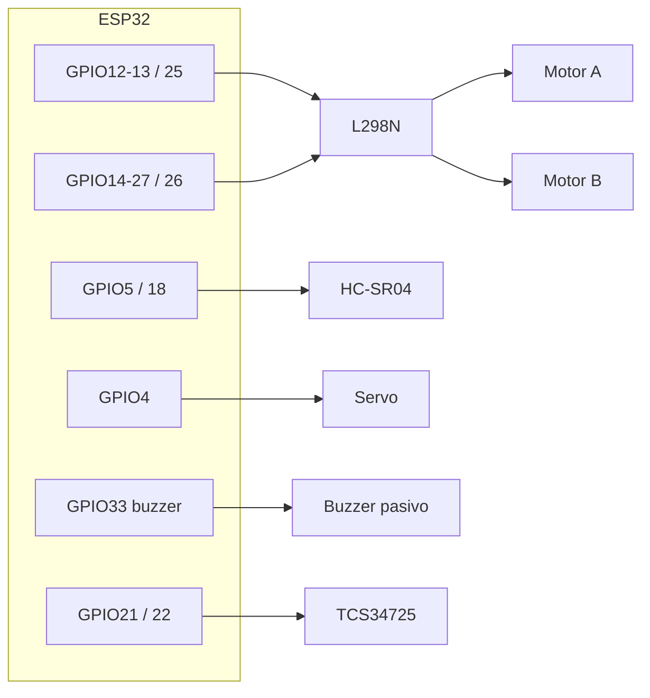

# Pines físicos e interconexiones — ProyectoLaberintoIA2026

**Ruta fija de este archivo:** `C:\PROYECTOS-PERSONALES\ProyectoLaberintoIA2026\INTERCONEXIONES-PINES.md`

Fuente principal: comentarios y `#define` en `FirmwareRobotLaberinto/FirmwareRobotLaberinto.ino`, y `FirmwareRobotLaberinto/diagram.json` (Wokwi: ESP32 + L298N + HC-SR04; sin servo ni TCS34725 en el JSON).

**Placa de referencia del cableado:** ESP32-WROOM-32 en **DevKit de 38 pines** (formato largo 2×19, a menudo vendido como *v1.3*). Los **números GPIO del código** son los mismos que en la variante de 30 pines; en la serigrafía suele verse **IO12**, **IO25**, etc. (el número tras `IO` = GPIO). Detalle: `FirmwareRobotLaberinto/GUIA_PLACA_ESP32_38_PINES.md`.

---

## 0. ESP32 DevKit **38 pines (v1.3)** — cómo leer la placa

- El firmware **solo nombra GPIO** (`12`, `GPIO21`…). En la placa física busca **IO12**, **IO21** o **GPIO21** junto al agujero.
- Algunas placas marcan **D4**, **D18**… En muchos clones **D*n* = GPIO *n***, pero si tu manual del vendedor dice otra cosa, **prevalece el manual**.
- **No usamos** GPIO0, GPIO2 ni GPIO15 en este proyecto (evitan líos de arranque / LED integrado en muchas placas).
- **Arduino IDE:** *Herramientas → Placa* → suele funcionar **“ESP32 Dev Module”** o **“DOIT ESP32 DEVKIT V1”**.
- **Wokwi:** `diagram.json` usa `wokwi-esp32-devkit-v1`; las **líneas GPIO** coinciden con tu DevKit de 38 pines.

| GPIO | En el robot / módulo |
|------|----------------------|
| **12, 13, 25** | L298N motor A (IN1, IN2, ENA PWM) |
| **14, 27, 26** | L298N motor B (IN3, IN4, ENB PWM) |
| **5, 18** | HC-SR04 Trig, Echo |
| **4** | Servo señal PWM |
| **33** | Buzzer pasivo (PWM ~2.5 kHz; continuo cuando `CELDA=ROJO`) |
| **21, 22** | I2C → TCS34725 (SDA, SCL) |
| **34, 35** | FC-03 encoder (DO digital) — llanta A / llanta B (`USE_WHEEL_ENCODERS` en firmware; VCC FC-03 a **3V3**) |
| **3V3, GND, VIN** | Según placa: 3V3/GND a sensores; alimentación del ESP32 por USB o VIN según montaje |

---

## Vista rápida (GPIO — DevKit 30 o 38 pines, mismo mapa lógico)

| GPIO ESP32 | Componente | Pin del módulo / función |
|------------|------------|---------------------------|
| **12** | L298N | IN1 (motor A) |
| **13** | L298N | IN2 (motor A) |
| **14** | L298N | IN3 (motor B) |
| **27** | L298N | IN4 (motor B) |
| **25** | L298N | ENA (PWM motor A) |
| **26** | L298N | ENB (PWM motor B) |
| **5** | HC-SR04 | Trig |
| **18** | HC-SR04 | Echo |
| **4** | Servo SG90 (o similar) | Señal PWM (naranja/amarilla) |
| **33** | Buzzer pasivo | Señal + (ideal 100–220 Ω en serie); otro polo GND |
| **21** | TCS34725 | SDA (I2C) |
| **22** | TCS34725 | SCL (I2C) |
| **34** | FC-03 (llanta motor A / L298N canal A) | **DO** (señal; **VCC del módulo a 3V3** del ESP32 para nivel lógico 3,3 V) |
| **35** | FC-03 (llanta motor B) | **DO** |

**GND común:** ESP32, L298N (lógica), HC-SR04, servo, TCS34725 y retorno de la alimentación de motores deben compartir referencia de masa según tu esquema de alimentación.

---

## 1. L298N — puente H (dos canales = dos llantas)

**Del ESP32 al L298N (control):**

- Motor A: **IN1 → GPIO12**, **IN2 → GPIO13**, **ENA → GPIO25** (PWM).
- Motor B: **IN3 → GPIO14**, **IN4 → GPIO27**, **ENB → GPIO26** (PWM).
- **GND** del L298N (módulo) con **GND ESP32** (común de señales).

**Salidas del L298N (potencia):**

- **OUT1 / OUT2** → motor del canal A (polaridad según giro deseado).
- **OUT3 / OUT4** → motor del canal B.

**Alimentación:**

- Los **motores** se alimentan desde la **entrada de potencia del L298N** (típicamente 12 V o la tensión de tu batería según datasheet del módulo). **No** alimentes los motores desde el pin 3V3 del ESP32.
- El ESP32 puede alimentarse por USB o por su propio regulador/VIN según tu montaje; lo importante es **un solo plano de GND** entre ESP32, L298N, sensores y servo.

---

## 2. HC-SR04 (ultrasonido, suele ir en el brazo del servo)

| HC-SR04 | Conexión recomendada |
|---------|----------------------|
| **VCC** | **5 V** (idealmente mismo rail que el servo si comparten; GND común al ESP32). |
| **GND** | **GND** común con ESP32. |
| **Trig** | **GPIO5** |
| **Echo** | **GPIO18** |

*Nota:* Echo a 5 V en muchos HC-SR04 es tolerado por GPIO del ESP32 en la práctica; si quieres máxima prudencia eléctrica, usa divisor de tensión 5 V → 3,3 V en Echo.

---

## 3. Servo 180° (orienta el ultrasonido)

| Cable típico (SG90) | Conexión |
|---------------------|----------|
| Marrón / negro | **GND** común |
| Rojo | **+5 V** (mejor fuente que aguante picos de corriente; si el servo “tira” mucho, alimentación dedicada con GND unido al ESP32) |
| Naranja / amarilla (señal) | **GPIO4** |

---

## 4. Buzzer pasivo GPIO33 — alarma cuando la celda es ROJA

El firmware emite PWM continuo (**`BUZZER_FREQ_HZ`**, por defecto 2,5 kHz) en **GPIO33** cuando `classifyCell` devuelve **ROJO** (lecturas por TCP `LEER`, monitor USB periódico y tras comandos que envían `CELDA:`).

| Buzzer pasivo típico | ESP32 |
|----------------------|-------|
| Terminal marcado **`+`** o señal | **GPIO33** (resistencia en serie ~100–220 Ω recomendable) |
| **`–`** / GND | **GND** común |

**Nota:** con buzzer **activo** solo hay que llevar alto/bajo desde un GPIO sin esta lógica de tono PWM; este firmware está pensado para **pasivo** (tono definido por frecuencia PWM).

---

## 5. Sensor de color TCS34725 (I2C, mira al suelo)

| Módulo TCS34725 | ESP32 |
|-----------------|-------|
| VIN o 3V3 | **3V3** (lógica 3,3 V) |
| GND | **GND** |
| SDA | **GPIO21** (`Wire` por defecto) |
| SCL | **GPIO22** |
| LED (si existe en la placa) | Según datasheet de la placa; a menudo opcional |

**Dirección I2C:** el firmware prueba **0x29** y **0x39**.

---

## 6. Encoders FC-03 (fotorranura / “encoder” de pulsos, un módulo por llanta)

Usa el pin **DO** (salida digital del comparador). **AO** no hace falta. El firmware cuenta flancos en **CHANGE** y en **`MOVER:*`** aplica control **PI** sobre el PWM: si una llanta lleva más pulsos que la otra, baja su PWM y sube el de la rezagada hasta igualar (recto y giros). Ajustes en `FirmwareRobotLaberinto.ino` (`ENCODER_KP`, `ENCODER_KI`, `ENCODER_MAX_TRIM`). Pruebas: `CalibracionLlantas` (comandos `e`, `9`, `1`–`5`).

| FC-03 | ESP32 |
|-------|-------|
| **VCC** | **3V3** del ESP32 (así **DO** suele ser lógica 3,3 V segura en GPIO **34** y **35**; si alimentás el FC-03 a 5 V, comprobá que **DO** no exceda 3,3 V en el pin del ESP32) |
| **GND** | **GND** común |
| **DO** | **GPIO34** (llanta del **motor canal A** / L298N lado A) o **GPIO35** (llanta **motor B**) — ver `ENCODER_WHEEL_*` en el `.ino` |
| **AO** | (no usar) |

**Mecánica:** necesitás un disco con agujeros (o pestañas) que corte la ranura IR del FC-03 cuando la rueda gira; sin eso no hay pulsos y no hay corrección.

### 6.1 Balance post-MOVER / post-MOVEW (recto): retroceso por pulsos

Funciona tras cualquier orden recta (kind 1 = `ADELANTE`, kind 2 = `ATRAS`):

- **`MOVER:ADELANTE` / `MOVER:ATRAS`** (cruceta por tiempo o por pulsos `:E…`). La diferencia esperada es **0** (el firmware quiere `A == B`).
- **`MOVEW:ADELANTE:A…:B…` / `MOVEW:ATRAS:A…:B…`** (cruceta de la web cuando están activados los pulsos por flecha). La diferencia esperada es `targetA − targetB`. Si configurás `↑ A=10 B=10` y por inercia queda `A=15 B=11`, el balance hace que **A retroceda 4 pulsos** (no toca la diferencia que vos quisiste tener entre las ruedas).

Reglas:

- Calcula `actualDiff = A − B`, `err = actualDiff − expectedDiff`. Si **`|err| ≥ ENCODER_BALANCE_MIN_DIFF`** (2 por defecto), la rueda que sobrepasó retrocede `|err|` pulsos en sentido contrario al del MOVE original.
- En **giros (`IZQUIERDA`/`DERECHA`)** la diferencia entre A y B es geometría del giro, no error: el balance **no se aplica** (el firmware sigue con `POST_TURN_SETTLE_MS` si tu config lo usa).
- Si pasa `ENCODER_BALANCE_TIMEOUT_MS` (1500 ms por defecto) sin alcanzar la meta, se corta y se manda `LISTO` igual; el log USB lo marca `[BAL] TIMEOUT`.

**Importante con los contadores:** los FC-03 sólo cuentan flancos (no saben dirección), así que **el contador del encoder sólo crece**. Si A=20 B=28 y B retrocede 8, el ENC final será A=20, B=36 (Δ=−16) — físicamente la rueda B sí dio los 8 pulsos atrás. Para confirmar que el balance corrió sin depender de Δ, usá la línea **`BAL:fin:OK:rueda=…:delta=…/…:A=…:B=…`** (el panel ya la muestra como `BAL B retrocedió 8 pulsos`).

Knobs en `FirmwareRobotLaberinto.ino` (recompilar para cambiarlos):

| Define | Default | Qué hace |
|--------|---------|----------|
| `ENCODER_POST_MOVE_BALANCE` | `1` | Compila la fase de balance. `0` = la elimina. |
| `ENCODER_BALANCE_MIN_DIFF` | `2` | Umbral para activar (ignora ruido de 1 pulso). |
| `ENCODER_BALANCE_PWM` | `130` | PWM con que retrocede la rueda que sobró. |
| `ENCODER_BALANCE_TIMEOUT_MS` | `1500` | Tope duro de la fase. |

**Comandos TCP runtime (sin recompilar):**

| Comando | Respuesta |
|---------|-----------|
| `BALANCE:0` (o `BALANCE:OFF`) | `OK:BALANCE off` + `LISTO`. Apaga el balance hasta el próximo reinicio. |
| `BALANCE:1` (o `BALANCE:ON`) | `OK:BALANCE on` + `LISTO`. |
| `BALANCE` (o `BALANCE:STATUS`) | `BALANCE:enabled=…:active=…:mindiff=…:pwm=…:timeout_ms=…` + `LISTO`. |

**Cómo probarlo desde el panel web (rápido):**

1. Subí el firmware nuevo al ESP32. En el Monitor serie deberías leer:
   `Balance post-MOVER (recto): ON min_diff=2 pwm=130 timeout=1500 ms — comandos: BALANCE:0/1/STATUS`.
2. **Probar el retroceso por encoder aislado** (sin balance, prueba directa de pulsos negativos):
   - En el panel manual, sección **Llanta A**, escribí `PULSOS = -5` y apretá **GIRAR LLANTA A**. La rueda A tiene que girar 5 pulsos hacia atrás y parar sola. Repetí con **Llanta B** (`-5` y **GIRAR LLANTA B**). Esto confirma que `MOTOR:A:E-N` funciona — es el mismo motor primitivo que usa el balance.
3. **Probar el balance automático tras MOVEW** (cruceta con pulsos por flecha):
   - Configurá `↑ A=10 B=10` (mismos pulsos para las dos llantas) y apretá **↑ ARRIBA**.
   - Cuando termine, en el banner inferior tenés que leer algo así:
     `MOVER adelante — LISTO · ENC A=12 B=14 Δ=-2 PWM 0/0 · BAL B retrocedió 2 pulsos (Δreal -2 · Δesperado 0)`.
   - Si querés "forzar" desbalance para verificarlo, sube algo bajo una rueda o tapá un FC-03 unos pulsos: cuando vuelvas a apretar ↑ tiene que aparecer `BAL …`.
4. **Probar el balance en MOVER por tiempo (sin pulsos por flecha):**
   - **Apagá** "PULSOS POR LLANTA PARA FLECHAS" en el panel y apretá ↑ con `ms=600` (el panel ya manda `MOVER:ADELANTE:600`).
   - Banner: `MOVER adelante — LISTO · ENC A=20 B=28 Δ=-8 PWM 0/0 · BAL B retrocedió 8 pulsos (Δreal -8 · Δesperado 0)`.
5. **Configuración intencionalmente desigual** (no se debe corregir):
   - Configurá `↑ A=25 B=10` (queremos a propósito que A dé 15 más que B). Apretá ↑.
   - El banner debería NO incluir `BAL …` (la `expectedDiff = 15` se respeta; sólo se compensan derivas mayores al umbral).
6. **Apagar el balance en caliente** (para comparar): por una terminal TCP (telnet a la IP en puerto 8888) mandá `BALANCE:0`. Repetí ↑ y ahora el banner queda con `Δ ≠ 0` y sin `BAL …`. Volvé a encender con `BALANCE:1`.

**Importante:** los FC-03 cuentan flancos sin distinguir dirección, así que el contador del encoder **sólo crece**. Si A=20 B=28 y B retrocede 8, el ENC final será **A=20 B=36 (Δ=−16)** — físicamente B sí retrocedió, simplemente el contador subió igual. Por eso el panel muestra la línea `BAL B retrocedió 8 pulsos`: es la verdad del movimiento físico aunque la `Δ` numérica empeore.

**Si el banner muestra `BAL B TIMEOUT (0/8 pulsos)`** (o cualquier `delta=0/…`):

- El motor no rompe rozamiento estático con `ENCODER_BALANCE_PWM=130`. Subílo a `160–180` y reflasheá.
- Revisá el FC-03 de esa rueda: girando la rueda a mano debe parpadear el LED de señal del módulo.
- Confirmá conexionado: `DO` de la llanta A → **GPIO34**, llanta B → **GPIO35**.

---

## 7. Diagrama lógico (quién va a quién)

---

## 8. Simulador Wokwi (`diagram.json`)

El modelo `wokwi-esp32-devkit-v1` representa el DevKit estándar; los **GPIO del JSON son los mismos** que debes usar en la placa **física de 38 pines (v1.3)** (serigrafía **IOxx**).

En Wokwi solo figuran **ESP32 + L298N + HC-SR04** (sin buzzer ni servo/TCS34725 en el JSON); **GPIO33 buzzer** aplica igual en hardware real. Conexiones adicionales al esquema anterior:

- **esp32:VIN** → **hc-sr04:VCC** y **l298n:VCC** (según el JSON; en hardware real sueles separar alimentación de motores vs lógica).
- **esp32:GND** → **hc-sr04:GND** y **l298n:GND**.

Para simulación sin color: en el `.ino`, `USE_COLOR_SENSOR 0`.

---

*Puertos típicos: **5050** (panel Flask en PC por defecto; `WEB_UI_PORT` para cambiarlo), **8888** (TCP servidor en el ESP32).*
