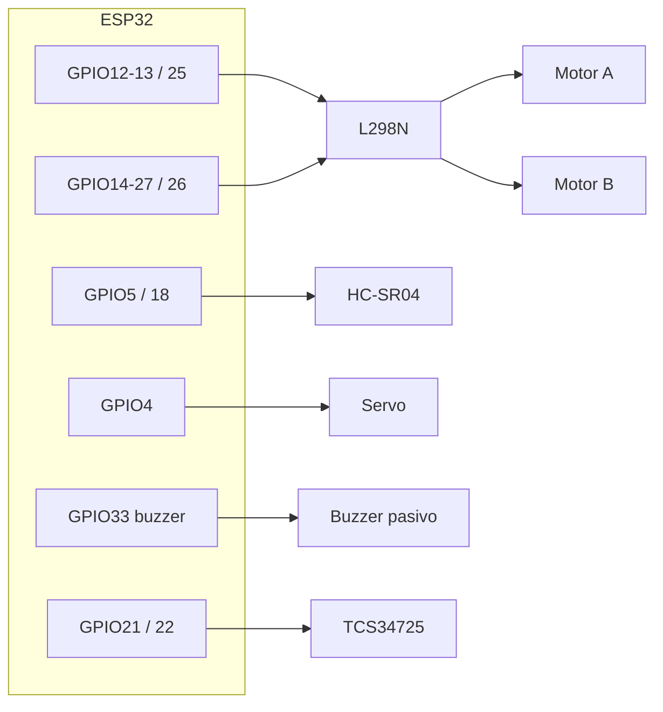

# Pines físicos e interconexiones — ProyectoLaberintoIA2026

**Ruta fija de este archivo:** `C:\PROYECTOS-PERSONALES\ProyectoLaberintoIA2026\INTERCONEXIONES-PINES.md`

Fuente principal: comentarios y `#define` en `FirmwareRobotLaberinto/FirmwareRobotLaberinto.ino`, y `FirmwareRobotLaberinto/diagram.json` (Wokwi: ESP32 + L298N + HC-SR04; sin servo ni TCS34725 en el JSON).

**Placa de referencia del cableado:** ESP32-WROOM-32 en **DevKit de 38 pines** (formato largo 2×19, a menudo vendido como *v1.3*). Los **números GPIO del código** son los mismos que en la variante de 30 pines; en la serigrafía suele verse **IO12**, **IO25**, etc. (el número tras `IO` = GPIO). Detalle: `FirmwareRobotLaberinto/GUIA_PLACA_ESP32_38_PINES.md`.

---

## 0. ESP32 DevKit **38 pines (v1.3)** — cómo leer la placa

- El firmware **solo nombra GPIO** (`12`, `GPIO21`…). En la placa física busca **IO12**, **IO21** o **GPIO21** junto al agujero.
- Algunas placas marcan **D4**, **D18**… En muchos clones **D*n* = GPIO *n***, pero si tu manual del vendedor dice otra cosa, **prevalece el manual**.
- **No usamos** GPIO0, GPIO2 ni GPIO15 en este proyecto (evitan líos de arranque / LED integrado en muchas placas).
- **Arduino IDE:** *Herramientas → Placa* → suele funcionar **“ESP32 Dev Module”** o **“DOIT ESP32 DEVKIT V1”**.
- **Wokwi:** `diagram.json` usa `wokwi-esp32-devkit-v1`; las **líneas GPIO** coinciden con tu DevKit de 38 pines.

| GPIO | En el robot / módulo |
|------|----------------------|
| **12, 13, 25** | L298N motor A (IN1, IN2, ENA PWM) |
| **14, 27, 26** | L298N motor B (IN3, IN4, ENB PWM) |
| **5, 18** | HC-SR04 Trig, Echo |
| **4** | Servo señal PWM |
| **33** | Buzzer pasivo (PWM ~2.5 kHz; continuo cuando `CELDA=ROJO`) |
| **21, 22** | I2C → TCS34725 (SDA, SCL) |
| **3V3, GND, VIN** | Según placa: 3V3/GND a sensores; alimentación del ESP32 por USB o VIN según montaje |

---

## Vista rápida (GPIO — DevKit 30 o 38 pines, mismo mapa lógico)

| GPIO ESP32 | Componente | Pin del módulo / función |
|------------|------------|---------------------------|
| **12** | L298N | IN1 (motor A) |
| **13** | L298N | IN2 (motor A) |
| **14** | L298N | IN3 (motor B) |
| **27** | L298N | IN4 (motor B) |
| **25** | L298N | ENA (PWM motor A) |
| **26** | L298N | ENB (PWM motor B) |
| **5** | HC-SR04 | Trig |
| **18** | HC-SR04 | Echo |
| **4** | Servo SG90 (o similar) | Señal PWM (naranja/amarilla) |
| **33** | Buzzer pasivo | Señal + (ideal 100–220 Ω en serie); otro polo GND |
| **21** | TCS34725 | SDA (I2C) |
| **22** | TCS34725 | SCL (I2C) |

**GND común:** ESP32, L298N (lógica), HC-SR04, servo, TCS34725 y retorno de la alimentación de motores deben compartir referencia de masa según tu esquema de alimentación.

---

## 1. L298N — puente H (dos canales = dos llantas)

**Del ESP32 al L298N (control):**

- Motor A: **IN1 → GPIO12**, **IN2 → GPIO13**, **ENA → GPIO25** (PWM).
- Motor B: **IN3 → GPIO14**, **IN4 → GPIO27**, **ENB → GPIO26** (PWM).
- **GND** del L298N (módulo) con **GND ESP32** (común de señales).

**Salidas del L298N (potencia):**

- **OUT1 / OUT2** → motor del canal A (polaridad según giro deseado).
- **OUT3 / OUT4** → motor del canal B.

**Alimentación:**

- Los **motores** se alimentan desde la **entrada de potencia del L298N** (típicamente 12 V o la tensión de tu batería según datasheet del módulo). **No** alimentes los motores desde el pin 3V3 del ESP32.
- El ESP32 puede alimentarse por USB o por su propio regulador/VIN según tu montaje; lo importante es **un solo plano de GND** entre ESP32, L298N, sensores y servo.

---

## 2. HC-SR04 (ultrasonido, suele ir en el brazo del servo)

| HC-SR04 | Conexión recomendada |
|---------|----------------------|
| **VCC** | **5 V** (idealmente mismo rail que el servo si comparten; GND común al ESP32). |
| **GND** | **GND** común con ESP32. |
| **Trig** | **GPIO5** |
| **Echo** | **GPIO18** |

*Nota:* Echo a 5 V en muchos HC-SR04 es tolerado por GPIO del ESP32 en la práctica; si quieres máxima prudencia eléctrica, usa divisor de tensión 5 V → 3,3 V en Echo.

---

## 3. Servo 180° (orienta el ultrasonido)

| Cable típico (SG90) | Conexión |
|---------------------|----------|
| Marrón / negro | **GND** común |
| Rojo | **+5 V** (mejor fuente que aguante picos de corriente; si el servo “tira” mucho, alimentación dedicada con GND unido al ESP32) |
| Naranja / amarilla (señal) | **GPIO4** |

---

## 4. Buzzer pasivo GPIO33 — alarma cuando la celda es ROJA

El firmware emite PWM continuo (**`BUZZER_FREQ_HZ`**, por defecto 2,5 kHz) en **GPIO33** cuando `classifyCell` devuelve **ROJO** (lecturas por TCP `LEER`, monitor USB periódico y tras comandos que envían `CELDA:`).

| Buzzer pasivo típico | ESP32 |
|----------------------|-------|
| Terminal marcado **`+`** o señal | **GPIO33** (resistencia en serie ~100–220 Ω recomendable) |
| **`–`** / GND | **GND** común |

**Nota:** con buzzer **activo** solo hay que llevar alto/bajo desde un GPIO sin esta lógica de tono PWM; este firmware está pensado para **pasivo** (tono definido por frecuencia PWM).

---

## 5. Sensor de color TCS34725 (I2C, mira al suelo)

| Módulo TCS34725 | ESP32 |
|-----------------|-------|
| VIN o 3V3 | **3V3** (lógica 3,3 V) |
| GND | **GND** |
| SDA | **GPIO21** (`Wire` por defecto) |
| SCL | **GPIO22** |
| LED (si existe en la placa) | Según datasheet de la placa; a menudo opcional |

**Dirección I2C:** el firmware prueba **0x29** y **0x39**.

---

## 6. Diagrama lógico (quién va a quién)

---

## 7. Simulador Wokwi (`diagram.json`)

El modelo `wokwi-esp32-devkit-v1` representa el DevKit estándar; los **GPIO del JSON son los mismos** que debes usar en la placa **física de 38 pines (v1.3)** (serigrafía **IOxx**).

En Wokwi solo figuran **ESP32 + L298N + HC-SR04** (sin buzzer ni servo/TCS34725 en el JSON); **GPIO33 buzzer** aplica igual en hardware real. Conexiones adicionales al esquema anterior:

- **esp32:VIN** → **hc-sr04:VCC** y **l298n:VCC** (según el JSON; en hardware real sueles separar alimentación de motores vs lógica).
- **esp32:GND** → **hc-sr04:GND** y **l298n:GND**.

Para simulación sin color: en el `.ino`, `USE_COLOR_SENSOR 0`.

---

*Puertos típicos: **5050** (panel Flask en PC por defecto; `WEB_UI_PORT` para cambiarlo), **8888** (TCP servidor en el ESP32).*
