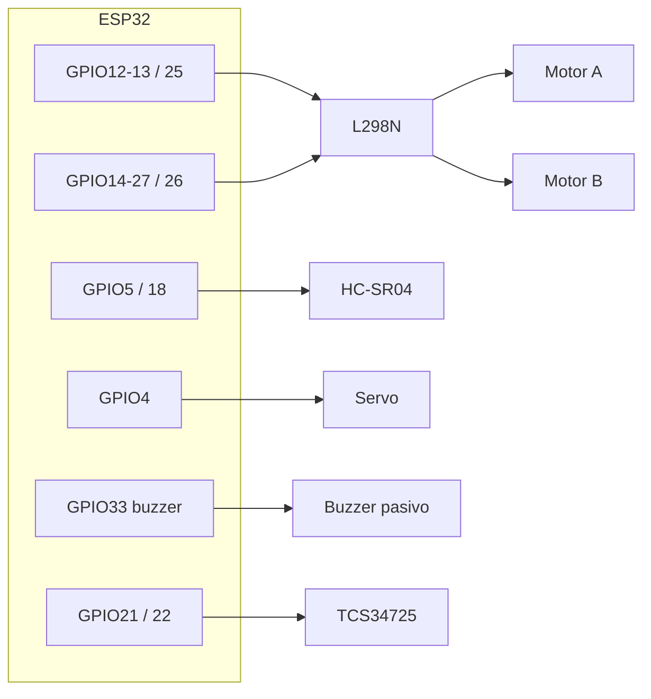

# Pines físicos e interconexiones — ProyectoLaberintoIA2026

**Ruta fija de este archivo:** `C:\PROYECTOS-PERSONALES\ProyectoLaberintoIA2026\INTERCONEXIONES-PINES.md`

Fuente principal: comentarios y `#define` en `FirmwareRobotLaberinto/FirmwareRobotLaberinto.ino`, y `FirmwareRobotLaberinto/diagram.json` (Wokwi: ESP32 + L298N + HC-SR04; sin servo ni TCS34725 en el JSON).

**Placa de referencia del cableado:** ESP32-WROOM-32 en **DevKit de 38 pines** (formato largo 2×19, a menudo vendido como *v1.3*). Los **números GPIO del código** son los mismos que en la variante de 30 pines; en la serigrafía suele verse **IO12**, **IO25**, etc. (el número tras `IO` = GPIO). Detalle: `FirmwareRobotLaberinto/GUIA_PLACA_ESP32_38_PINES.md`.

---

## 0. ESP32 DevKit **38 pines (v1.3)** — cómo leer la placa

- El firmware **solo nombra GPIO** (`12`, `GPIO21`…). En la placa física busca **IO12**, **IO21** o **GPIO21** junto al agujero.
- Algunas placas marcan **D4**, **D18**… En muchos clones **D*n* = GPIO *n***, pero si tu manual del vendedor dice otra cosa, **prevalece el manual**.
- **No usamos** GPIO0, GPIO2 ni GPIO15 en este proyecto (evitan líos de arranque / LED integrado en muchas placas).
- **Arduino IDE:** *Herramientas → Placa* → suele funcionar **“ESP32 Dev Module”** o **“DOIT ESP32 DEVKIT V1”**.
- **Wokwi:** `diagram.json` usa `wokwi-esp32-devkit-v1`; las **líneas GPIO** coinciden con tu DevKit de 38 pines.

| GPIO | En el robot / módulo |
|------|----------------------|
| **12, 13, 25** | L298N motor A (IN1, IN2, ENA PWM) |
| **14, 27, 26** | L298N motor B (IN3, IN4, ENB PWM) |
| **5, 18** | HC-SR04 Trig, Echo |
| **4** | Servo señal PWM |
| **33** | Buzzer pasivo (PWM ~2.5 kHz; continuo cuando `CELDA=ROJO`) |
| **21, 22** | I2C → TCS34725 (SDA, SCL) |
| **34, 35** | FC-03 encoder (DO digital) — llanta A / llanta B (`USE_WHEEL_ENCODERS` en firmware; VCC FC-03 a **3V3**) |
| **3V3, GND, VIN** | Según placa: 3V3/GND a sensores; alimentación del ESP32 por USB o VIN según montaje |

---

## Vista rápida (GPIO — DevKit 30 o 38 pines, mismo mapa lógico)

| GPIO ESP32 | Componente | Pin del módulo / función |
|------------|------------|---------------------------|
| **12** | L298N | IN1 (motor A) |
| **13** | L298N | IN2 (motor A) |
| **14** | L298N | IN3 (motor B) |
| **27** | L298N | IN4 (motor B) |
| **25** | L298N | ENA (PWM motor A) |
| **26** | L298N | ENB (PWM motor B) |
| **5** | HC-SR04 | Trig |
| **18** | HC-SR04 | Echo |
| **4** | Servo SG90 (o similar) | Señal PWM (naranja/amarilla) |
| **33** | Buzzer pasivo | Señal + (ideal 100–220 Ω en serie); otro polo GND |
| **21** | TCS34725 | SDA (I2C) |
| **22** | TCS34725 | SCL (I2C) |
| **34** | FC-03 (llanta motor A / L298N canal A) | **DO** (señal; **VCC del módulo a 3V3** del ESP32 para nivel lógico 3,3 V) |
| **35** | FC-03 (llanta motor B) | **DO** |

**GND común:** ESP32, L298N (lógica), HC-SR04, servo, TCS34725 y retorno de la alimentación de motores deben compartir referencia de masa según tu esquema de alimentación.

---

## 1. L298N — puente H (dos canales = dos llantas)

**Del ESP32 al L298N (control):**

- Motor A: **IN1 → GPIO12**, **IN2 → GPIO13**, **ENA → GPIO25** (PWM).
- Motor B: **IN3 → GPIO14**, **IN4 → GPIO27**, **ENB → GPIO26** (PWM).
- **GND** del L298N (módulo) con **GND ESP32** (común de señales).

**Salidas del L298N (potencia):**

- **OUT1 / OUT2** → motor del canal A (polaridad según giro deseado).
- **OUT3 / OUT4** → motor del canal B.

**Alimentación:**

- Los **motores** se alimentan desde la **entrada de potencia del L298N** (típicamente 12 V o la tensión de tu batería según datasheet del módulo). **No** alimentes los motores desde el pin 3V3 del ESP32.
- El ESP32 puede alimentarse por USB o por su propio regulador/VIN según tu montaje; lo importante es **un solo plano de GND** entre ESP32, L298N, sensores y servo.

---

## 2. HC-SR04 (ultrasonido, suele ir en el brazo del servo)

| HC-SR04 | Conexión recomendada |
|---------|----------------------|
| **VCC** | **5 V** (idealmente mismo rail que el servo si comparten; GND común al ESP32). |
| **GND** | **GND** común con ESP32. |
| **Trig** | **GPIO5** |
| **Echo** | **GPIO18** |

*Nota:* Echo a 5 V en muchos HC-SR04 es tolerado por GPIO del ESP32 en la práctica; si quieres máxima prudencia eléctrica, usa divisor de tensión 5 V → 3,3 V en Echo.

---

## 3. Servo 180° (orienta el ultrasonido)

| Cable típico (SG90) | Conexión |
|---------------------|----------|
| Marrón / negro | **GND** común |
| Rojo | **+5 V** (mejor fuente que aguante picos de corriente; si el servo “tira” mucho, alimentación dedicada con GND unido al ESP32) |
| Naranja / amarilla (señal) | **GPIO4** |

---

## 4. Buzzer pasivo GPIO33 — alarma cuando la celda es ROJA

El firmware emite PWM continuo (**`BUZZER_FREQ_HZ`**, por defecto 2,5 kHz) en **GPIO33** cuando `classifyCell` devuelve **ROJO** (lecturas por TCP `LEER`, monitor USB periódico y tras comandos que envían `CELDA:`).

| Buzzer pasivo típico | ESP32 |
|----------------------|-------|
| Terminal marcado **`+`** o señal | **GPIO33** (resistencia en serie ~100–220 Ω recomendable) |
| **`–`** / GND | **GND** común |

**Nota:** con buzzer **activo** solo hay que llevar alto/bajo desde un GPIO sin esta lógica de tono PWM; este firmware está pensado para **pasivo** (tono definido por frecuencia PWM).

### 4.1 Velocidad del carro (PWM del L298N) — calibrar en caliente sin reflashear

Para celdas chicas (≤ 30 cm × 30 cm) y "menos meneo", **el PWM por defecto bajó de 200 a 150** (`PWM_SPEED_DEFAULT 150`). Esto reduce el torque inicial y el carro ya no patina ni se sacude al arrancar; con la misma `ms` que tenías (`750`), recorre **menos distancia** (más cerca de 30 cm).

**Comando TCP en caliente (no requiere reflashear):**

| Comando | Respuesta | Qué hace |
|---------|-----------|----------|
| `SPEED` | `SPEED:150` + `LISTO` | Consulta el PWM actual. |
| `SPEED:N` (N entre 1 y 255) | `OK:SPEED:N` + `LISTO` | Cambia el PWM de MOVER/MOTOR. Persiste hasta el reinicio. |

Recetas rápidas:

- Carro pesado / suelo con fricción: `SPEED:170` o `SPEED:200`.
- Celdas muy chicas / tracción muy fuerte: `SPEED:120`.
- Encoder no cuenta porque no rompe rozamiento: subí `SPEED:N` y/o `ENCODER_BALANCE_PWM`.

El log de boot ahora imprime: `PWM_SPEED inicial: 150 — runtime: SPEED:N (1..255)` y `STATUS` incluye `SPEED:N` para verificarlo desde el simulador.

---

## 5. Sensor de color TCS34725 (I2C, mira al suelo)

| Módulo TCS34725 | ESP32 |
|-----------------|-------|
| VIN o 3V3 | **3V3** (lógica 3,3 V) |
| GND | **GND** |
| SDA | **GPIO21** (`Wire` por defecto) |
| SCL | **GPIO22** |
| LED (si existe en la placa) | Según datasheet de la placa; a menudo opcional |

**Dirección I2C:** el firmware prueba **0x29** y **0x39**.

### 5.1 Clasificación de color robusta (anti AZUL→ROJO)

El TCS34725 tiene **leak infrarrojo en el canal R**: bajo luz mixta (sol, ambiente, LED del propio módulo encendido) un suelo **AZUL** puede dar `R` casi igual o un poco mayor que `B`. Las reglas viejas por proporciones (`pr/pg/pb > 0.39`) confunden eso como ROJO. El firmware actual usa una pipeline de tres pasos por orden de prioridad:

1. **Mediana de 3 lecturas** (`tcsMedianRaw`): cada `LEER` toma 3 muestras consecutivas y se queda con la mediana por canal. Mata fogonazos transitorios (vibración, sombra cruzada).
2. **Clasificación por matiz (Hue)** — la regla principal:
   - Convierte `R,G,B` a HSV y se queda con el ángulo de matiz (0-360°).
   - Bandas: **ROJO** `≥340° || ≤25°` · **VERDE** `70°–180°` · **AZUL** `185°–330°` (banda azul ancha a propósito para absorber el desplazamiento por IR-leak hacia magenta).
   - Sólo aplica si la saturación es ≥ 0.08 (descarta gris/sombra).
3. **Fallback por proporciones + reglas débiles**: si el matiz cayó en zona neutra o la saturación es baja, vuelve a las reglas viejas (`pr/pg/pb`) — sirve para seguir clasificando con luz pobre.

En el panel `Laberinto físico` la lectura llega como `CELDA:AZUL/ROJO/VERDE/UNKNOWN` igual que antes; **no hace falta cambiar nada en el frontend**. La pestaña `Calibración → Color` muestra la **regla disparada** (`hue-AZUL`, `prop-AZUL`, `weak-AZUL`, `fallback-RAW-B`, etc.) si querés ver qué rama lo clasificó.

**Si todavía ves un AZUL clasificado como ROJO en hardware:**

- Bajá el **LED blanco** del módulo Adafruit (jumper o pin LED a GND): elimina reflexión directa que falsea el R.
- Acercá el sensor al suelo (5-10 mm) para que C suba arriba de `TCS34725_CLEAR_MIN`.
- Si tu papel azul es muy oscuro, podés bajar el umbral de saturación recompilando: cambiar `0.08f` a `0.05f` en la regla por matiz.

---

## 6. Encoders FC-03 (fotorranura / “encoder” de pulsos, un módulo por llanta)

Usa el pin **DO** (salida digital del comparador). **AO** no hace falta. El firmware cuenta flancos en **CHANGE** y en **`MOVER:*`** aplica control **PI** sobre el PWM: si una llanta lleva más pulsos que la otra, baja su PWM y sube el de la rezagada hasta igualar (recto y giros). Ajustes en `FirmwareRobotLaberinto.ino` (`ENCODER_KP`, `ENCODER_KI`, `ENCODER_MAX_TRIM`). Pruebas: `CalibracionLlantas` (comandos `e`, `9`, `1`–`5`).

| FC-03 | ESP32 |
|-------|-------|
| **VCC** | **3V3** del ESP32 (así **DO** suele ser lógica 3,3 V segura en GPIO **34** y **35**; si alimentás el FC-03 a 5 V, comprobá que **DO** no exceda 3,3 V en el pin del ESP32) |
| **GND** | **GND** común |
| **DO** | **GPIO34** (llanta del **motor canal A** / L298N lado A) o **GPIO35** (llanta **motor B**) — ver `ENCODER_WHEEL_*` en el `.ino` |
| **AO** | (no usar) |

**Mecánica:** necesitás un disco con agujeros (o pestañas) que corte la ranura IR del FC-03 cuando la rueda gira; sin eso no hay pulsos y no hay corrección.

### 6.1 Balance post-MOVER / post-MOVEW (recto): "el carro se endereza solo"

Funciona automáticamente, sin intervención humana, tras cualquier orden recta (kind 1 = `ADELANTE`, kind 2 = `ATRAS`). En **giros** (`IZQUIERDA`/`DERECHA`) la diferencia entre A y B es geometría: ahí el balance no se aplica.

**Regla por defecto (modo automático para laberinto físico):**

- El firmware **siempre intenta dejar `A == B`** después de cada `MOVER:ADELANTE/ATRAS` o `MOVEW:ADELANTE/ATRAS:A:B`, **incluso si la cruceta de pulsos pidió `A≠B`**.
- Si querés volver al modo "respetar la asimetría que pediste" (legacy), recompilás con `ENCODER_BALANCE_RESPECT_PAIR_TARGETS 1`.

**SIMÉTRICO vs. PIVOTE (lo importante para que NO haga "vueltas de 270"):**

`ENCODER_BALANCE_MODE` decide cómo se aplica la corrección:

- **`1` SIMÉTRICO (default, "carro recto"):** la rueda con sobrante retrocede `|err|/2` pulsos **y al mismo tiempo** la rueda lenta avanza `|err|/2` pulsos. Las rotaciones netas terminan iguales en ambas llantas → **el chasis no rota**, sólo se mueve un toquito en la dirección original.
- **`0` PIVOTE (legacy):** la rueda con sobrante retrocede sola `|err|`, la otra queda detenida → **el chasis pivota** (es lo que se veía como "media vuelta" cuando se intentaba enderezar).

> Ejemplo. `MOVER:ADELANTE` deja `A=20`, `B=28` (la derecha pasó). En modo simétrico el firmware ordena: A avanza 4 pulsos más; B retrocede 4 pulsos. Estado final: `A=24, B=32` (en contadores) y rotaciones netas `A=24 fwd, B=24 fwd` → **carro recto**, ~0.5 cm más adelante.

**Cómo decide cuánto corregir:**

1. Lee `A`, `B` del encoder al terminar el MOVE.
2. `actualDiff = A − B`, `err = actualDiff − expectedDiff` (con `expectedDiff = 0` por defecto).
3. Si `|err| ≥ ENCODER_BALANCE_MIN_DIFF` (2 pulsos): arranca pasada de balance:
   - **modo SIM**: `targetA = targetB = |err|/2` (la mitad para cada llanta, dirigidas en sentidos opuestos).
   - **modo PIVOTE**: `target` única para la rueda con sobrante.
4. Cada llanta se detiene **apenas alcanza su `target` propio** (las dos pueden parar a tiempos distintos).
5. Si terminó bien y todavía hay desfase, repite hasta `ENCODER_BALANCE_MAX_PASSES` veces (3 por defecto). Si alguna pasada se queda sin pulsos en `ENCODER_BALANCE_TIMEOUT_MS`, se corta y se envía `LISTO` con `BAL:fin:TIMEOUT:…`.
6. Recién cuando el balance termina (o no era necesario), se manda `LISTO` al cliente. El panel lo muestra como `BAL SIM OK · 1 pasada · A 4 · B 4 pulsos (Δinicial -8 · Δesperado 0)`.

**Importante con los contadores:** los FC-03 sólo cuentan flancos (no saben dirección), así que **el contador del encoder sólo crece**. En modo SIM, tras corregir un `Δ=-8` vas a ver `A=24 B=32 Δ=-8` (el Δ no cambia), pero las **rotaciones reales** sí están equilibradas. Para confirmar usá las líneas `BAL:iniciar:modo=1:…:targetA=4:targetB=4:dirA=FWD:dirB=REV:…` y `BAL:fin:OK:…:deltaA=4/4:deltaB=4/4:…`.

Knobs en `FirmwareRobotLaberinto.ino` (recompilar para cambiarlos):

| Define | Default | Qué hace |
|--------|---------|----------|
| `ENCODER_POST_MOVE_BALANCE` | `1` | Compila la fase de balance. `0` = la elimina. |
| `ENCODER_BALANCE_MODE` | `1` | `1` = SIMÉTRICO/recto, `0` = PIVOTE/legacy. |
| `ENCODER_BALANCE_MIN_DIFF` | `2` | Umbral para activar (ignora ruido de 1 pulso). |
| `ENCODER_BALANCE_PWM` | `130` | PWM con que se mueven las llantas durante la corrección. |
| `ENCODER_BALANCE_TIMEOUT_MS` | `1500` | Tope duro de cada pasada. |
| `ENCODER_BALANCE_MAX_PASSES` | `3` | Pasadas extra si tras la primera quedaron desigualados. |
| `ENCODER_BALANCE_RESPECT_PAIR_TARGETS` | `0` | `0` = siempre `A==B` (autonomía). `1` = respeta la asimetría manual de la cruceta. |

**Comandos TCP runtime (sin recompilar):**

| Comando | Respuesta |
|---------|-----------|
| `BALANCE:0` (o `BALANCE:OFF`) | `OK:BALANCE off` + `LISTO`. Apaga el balance hasta el próximo reinicio. |
| `BALANCE:1` (o `BALANCE:ON`) | `OK:BALANCE on` + `LISTO`. |
| `BALANCE` (o `BALANCE:STATUS`) | `BALANCE:enabled=…:active=…:mindiff=…:pwm=…:timeout_ms=…:passes=…:pair_targets=…:mode=…` + `LISTO`. |

**Cómo probarlo en el laberinto físico (autonomía, sin tocar nada):**

1. **Reflasheá** el `.ino` (paso obligatorio: si no lo hacés, el firmware viejo todavía pivota una rueda sola y vas a seguir viendo "vueltas raras"). En el Monitor serie (115200 baud) al arrancar tiene que aparecer:
   `Balance post-MOVER (recto): ON min_diff=2 pwm=130 timeout=1500 ms passes=3 pairTargets=0 mode=1 (SIMETRICO/recto) — comandos: BALANCE:0/1/STATUS`.
2. Confirmá vía TCP (`telnet IP_ESP32 8888` o desde el simulador) que `BALANCE:STATUS` devuelve `…:mode=1`.
3. Poné el carrito en la celda inicial del laberinto y arrancá la **autonomía** desde `Laberinto físico` como siempre. **No hace falta** tocar "PULSOS POR LLANTA PARA FLECHAS" — incluso si quedaron valores raros, el firmware los ignora para el balance.
4. Tras CADA `MOVER:ADELANTE/ATRAS` (incluyendo los que manda la autonomía), el firmware emite SIEMPRE una línea sobre el balance, y el banner del panel la muestra:
   - **`BAL ✓ recto · Δreal 1 (umbral 2)`** → el firmware revisó y no hizo falta corregir.
   - **`BAL SIM OK · 1 pasada · A 4 · B 4 pulsos (Δinicial -8 · Δesperado 0)`** → corrigió simétricamente en una pasada.
   - **`BAL SIM OK · 2 pasadas · A 6 · B 6 pulsos`** → necesitó dos rondas (suelo o PWM justo).
   - **`BAL SIM TIMEOUT · A 3/4 · B 0/4 (pase 1)`** → un motor no rompe rozamiento; subí `ENCODER_BALANCE_PWM`.
   - **`BAL apagado · Δreal -8`** → mandaste `BALANCE:0` y el balance está deshabilitado en runtime.
   - **(sin línea BAL)** → estás corriendo el firmware viejo. Reflasheá.
5. Si ves `BAL ✓ recto` después de cada paso pero el carro físicamente se tuerce: el FC-03 de una rueda no está contando bien (o cuenta el doble que el otro). Hacé girar a mano cada rueda y mirá si el LED del módulo parpadea con el mismo número de pulsos en una vuelta completa.

**Comprobaciones manuales sueltas (si dudás del hardware):**

- **Pulsos negativos primitivos**: en el panel manual, **Llanta A → PULSOS=-5 → GIRAR LLANTA A**. La rueda A debe girar 5 pulsos hacia atrás y parar sola. Igual con Llanta B (`-5`). Es el mismo motor que usa el balance.
- **Movimiento recto + balance forzado**: con la cruceta web mantené `↑ A=10 B=10` y apretá ↑. Banner típico: `… ENC A=12 B=14 Δ=-2 … · BAL SIM OK · 1 pasada · A 1 · B 1 pulsos`.
- **Carro inclinado en una rueda**: ponele un papel grueso bajo una llanta para simular tracción asimétrica. Apretá ↑. Vas a ver `BAL SIM OK · 2-3 pasadas` con valores `A N · B M` mezclados — el firmware itera hasta dejar el carro derecho **sin hacerlo girar**.

**Si el banner muestra `BAL SIM TIMEOUT · A 0/N · B …`:**

- El motor no rompe rozamiento estático con `ENCODER_BALANCE_PWM=130`. Subílo a `160–180` y reflasheá.
- Revisá el FC-03 de esa rueda: girando la rueda a mano debe parpadear el LED de señal del módulo.
- Confirmá conexionado: `DO` llanta A → **GPIO34**, llanta B → **GPIO35**.

### 6.1.5 Cuidado: simulador activo sin querer

Si en el panel `Laberinto físico` ves al robot avanzando en el grid pero el carrito **físicamente no se mueve**, casi seguro tenés el **simulador encendido** (pestaña `SIMULADOR` → checkbox "Activar simulación (sin ESP32)"). En ese modo `/api/leer` y `/api/mover` NO tocan el ESP32: todo es virtual.

Indicadores visuales de simulador encendido:

- En el header aparece un **chip naranja parpadeante** `⚠ SIMULADOR ON · ESP32 SIN RECIBIR`.
- En el banner de autonomía: `⚠ SIMULADOR · Autonomía activa · … · ESP32 NO recibe comandos`.
- El estado del agente arranca como `SIM · Autonomía` en lugar de `Autonomía`.
- El strip de PING TCP dice `Simulador (sin TCP al ESP32)`.

**Protección al iniciar autonomía**: si tocás `Iniciar autonomía` con simulador ON **e IP del ESP32 configurada**, el panel pide confirmación con un `confirm()`:

> Simulador ENCENDIDO con IP configurada (192.168.x.x).
> La autonomía NO va a tocar al ESP32 — todo es virtual. El carrito físico se queda quieto.
> ¿Querés continuar simulando? (Cancelá para apagar el simulador y usar el ESP32 real.)

Si cancelás, el panel **apaga el simulador automáticamente**. Vas a tener que volver a tocar `Iniciar autonomía` con sim ya apagado para que la autonomía hable con el ESP32 real.

### 6.2 Modos del agente — reglas comunes anti-trabarse

Todos los modos (1 Programado, 2 Reactivo, 3 Explorador, 4/5 Planner A*/BFS, 6 QL demo) **comparten ahora una capa común de reacción a sensores** antes de ejecutar su lógica específica:

1. **`CELDA: VERDE` → meta alcanzada → autonomía detenida con éxito** (en cualquier modo).
2. **`CELDA: ROJO` → confirmación 2-de-2** contra falsos-positivos del canal R del TCS34725:
   - 1ra lectura ROJA → mensaje `Posible ROJO en TCS34725 — re-leo para confirmar (anti-falsos)`. NO se mueve nada, agenda el próximo ciclo.
   - 2da lectura ROJA consecutiva → **retroceso automático de 1 paso** (`MOVER:ATRAS`) + **marca la celda anterior como OBSTÁCULO** en el mapa interno + **continúa la autonomía**. Modo 4/5 dispara `doPlan(true)` para replanear desde la nueva pose; modo 3 vacía `tcpQueue` para que el explorador recompute en el siguiente ciclo.
   - Una sola lectura no-ROJA resetea el flag de pendiente.
3. **Anti-loop en modos reactivos (2 y 6):**
   - Cada giro `izquierda`/`derecha` incrementa `lfRecentTurnCount`. Cada `adelante`/`atras` lo resetea.
   - El **modo 2** alterna `izquierda`/`derecha` (recuerda el último giro y elige el opuesto en la próxima curva). Si lleva ≥4 giros consecutivos sin avanzar, fuerza un `atras` para escaparse de esquinas.
   - El **modo 6** elige aleatoriamente con sesgo: si el frente está libre (sin ultrasonido cerca, sin OBSTÁCULO marcado, dentro del grid), favorece `adelante`. Si no, sólo turns; con ≥3 giros consecutivos agrega `atras` al pool.
4. **Out-of-bounds preventivo:**
   - Antes de un `adelante`/`atras`, todos los modos calculan la celda destino. Si saldría del grid:
     - Modo 1 (cola fija) descarta el paso y sigue con la cola.
     - Modo 2 (reactivo) sustituye por giro alternado.
     - Modo 3 (explorador) vacía la cola TCP y replanea en el siguiente ciclo.
     - Modo 4/5 (planner) vacía la cola y replanea — esto se da sólo si el plan vino mal calculado (autoría externa).
     - Modo 6 (QL) sustituye por giro alternado.
5. **Rollback automático tras detectar ROJO durante el MOVER** (`execMover.lfLastDisplacementBlockedByRed`): el panel manda un pulso contrario sin preguntar y marca la celda al frente como `OBSTACULO` en el mapa interno. Modos 4/5 replanean automáticamente, modo 3 vacía la cola TCP.
6. **Refresh de "Percepción en vivo" al parar:** cualquier `stopAutorun()` (manual o por meta) dispara un `leer(true)` final para que la insignia muestre el color real actual y no quede "pegada" en el último ROJO transitorio del bucle.

**Específicamente por modo:**

| Modo | Estrategia | Para por VERDE | Para por coordenadas | Anti-loop | Replanea |
|------|------------|----------------|----------------------|-----------|----------|
| 1 Programado | Cola TCP fija con descarte de pasos imposibles | sí | no | n/a | n/a |
| 2 Reactivo | Reglas locales con giros alternados | sí | sí (Meta X/Y) | sí | n/a |
| 3 Explorador | Plan a la frontera DESCONOCIDO más cercana | sí | no | n/a | sí (vaciado de cola) |
| 4 A*/5 BFS | Plan completo → replanea cada ciclo | sí | sí (Meta X/Y) | n/a | sí (`doPlan(true)`) |
| 6 QL demo | Random-walk sesgado | sí | no | sí | n/a |

**Probarlo:** poné en la cola algo así para forzar cada caso:

```
adelante
adelante
adelante
adelante
adelante
```

en un grid 4×4 con el carro en `(0,0)` mirando arriba: tras 3 pasos llega al borde. El cuarto debería detenerse con el cartel "sale del mapa". Si ponés una celda roja en la trayectoria, debería detenerse al llegar con el cartel "celda ROJA detectada".

---

## 7. Diagrama lógico (quién va a quién)



---

## 8. Simulador Wokwi (`diagram.json`)

El modelo `wokwi-esp32-devkit-v1` representa el DevKit estándar; los **GPIO del JSON son los mismos** que debes usar en la placa **física de 38 pines (v1.3)** (serigrafía **IOxx**).

En Wokwi solo figuran **ESP32 + L298N + HC-SR04** (sin buzzer ni servo/TCS34725 en el JSON); **GPIO33 buzzer** aplica igual en hardware real. Conexiones adicionales al esquema anterior:

- **esp32:VIN** → **hc-sr04:VCC** y **l298n:VCC** (según el JSON; en hardware real sueles separar alimentación de motores vs lógica).
- **esp32:GND** → **hc-sr04:GND** y **l298n:GND**.

Para simulación sin color: en el `.ino`, `USE_COLOR_SENSOR 0`.

---

*Puertos típicos: **5050** (panel Flask en PC por defecto; `WEB_UI_PORT` para cambiarlo), **8888** (TCP servidor en el ESP32).*
